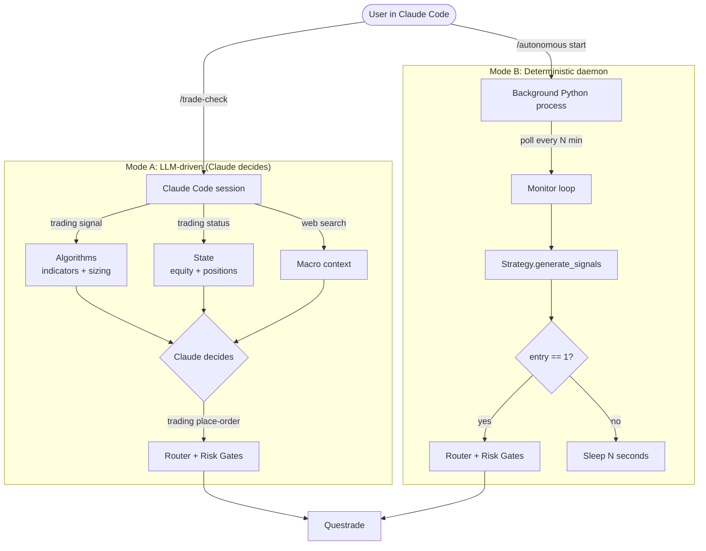
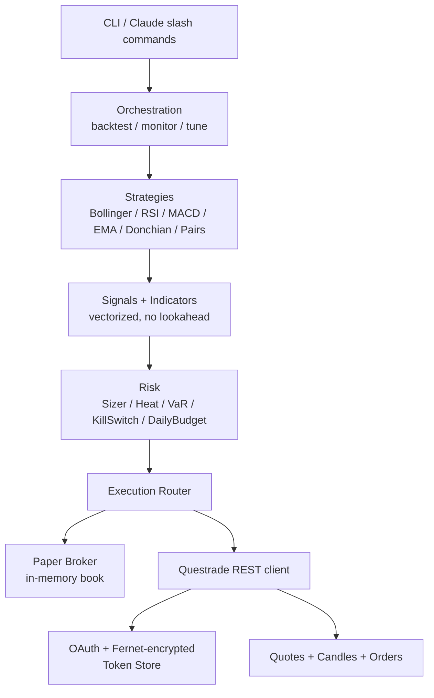
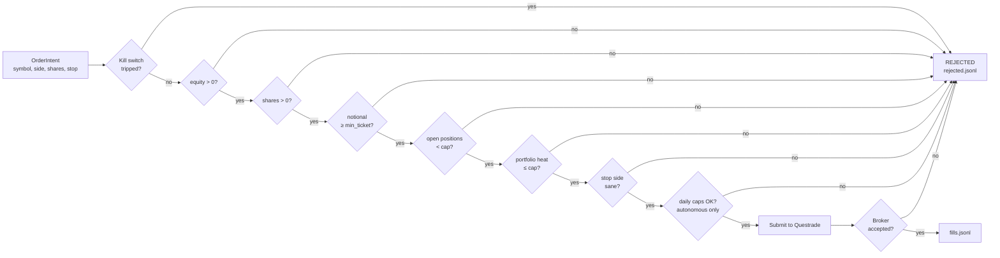
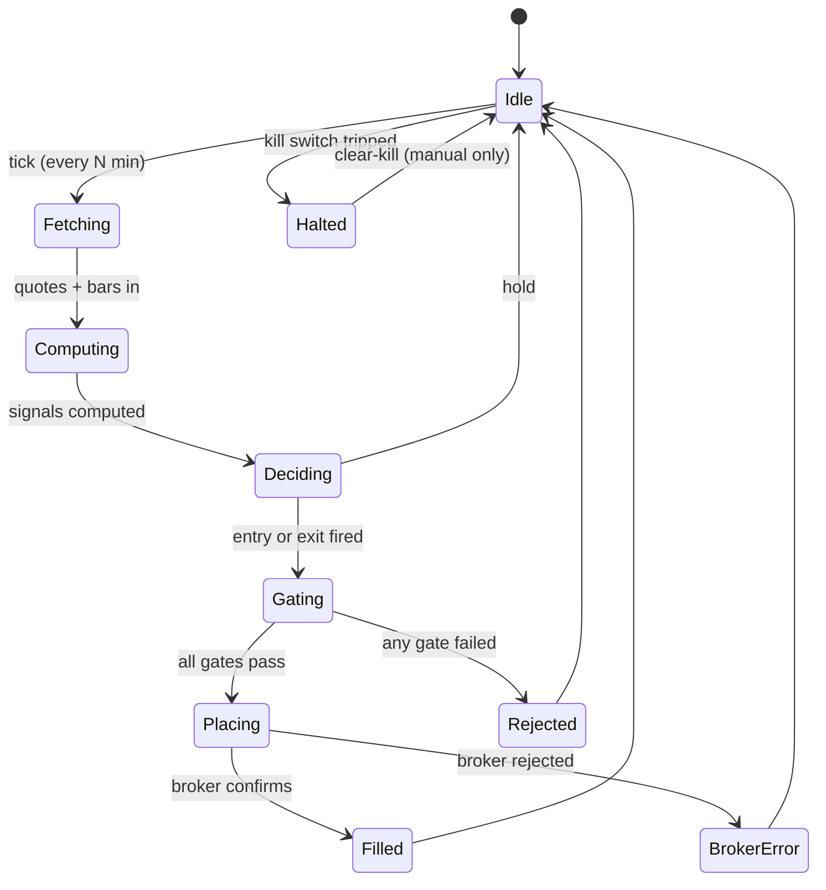

# trading-live-claude

Claude Code–driven algorithmic trading framework for **Questrade** (Canadian + US equities / ETFs). Paper-trading by default. Live trading behind explicit flags + risk gates.

Built around the five Claude Code skills from [Top 5 Claude Code Skills for Algorithmic Trading](https://medium.datadriveninvestor.com/top-5-claude-code-skills-for-algorithmic-trading-49620fa2b02c) — rewired to use Questrade as the single data + execution source instead of EODHD.

---

## Use with Claude Code

Open this repo in Claude Code. There are **two trading modes**:

| Mode | Who decides each buy/sell | Cost | Reliability | Setup |
|---|---|---|---|---|
| **LLM-driven** (`claude-trader` skill) | The Claude Code session itself | LLM API tokens per tick | Only runs while Claude is open (or via `/loop`) | `/trade-check` |
| **Deterministic daemon** (`autonomous`) | Python algorithm, no LLM | $0 | Runs forever, survives Claude closing | `/autonomous start` |

Both share the **same Router and risk gates**.



### LLM-driven flow (Claude decides, algorithms help)

```
> /trade-check
```

Claude does: gather state → pull signals from algorithms → analyze regime + cost + fit → decide buy/sell/hold → if buy/sell, call `uv run trading place-order ...` (still gated by Router).

Schedule it:
```
> /loop 10m /trade-check
```

Claude wakes itself every 10 min. **Stops when you close Claude.** For 24/7 trading without Claude open, use the deterministic daemon instead.

### Slash commands

| Command | What it does |
|---|---|
| **`/trade-check`** | **LLM-driven**: gather → analyze → decide → maybe place order |
| **`/trade-now <buy\|sell> <sym> <shares> <stop> [target] [reason]`** | Single order Claude already decided on |
| `/tune` | Backtests 5 strategies × 18 symbols; rewrites `config/trading.yaml` |
| `/backtest <strategy> <symbol> [years]` | One-off backtest, markdown report |
| `/signal-check <strategy> <symbols>` | Snapshot live signals; never places orders |
| `/paper-trade <strategy> <symbols> [iters]` | Paper session vs Questrade quotes |
| `/autonomous` (`status`/`start`/`stop`/`tail`) | Deterministic-daemon manager |
| `/positions` | Current Questrade holdings |
| `/risk-report` | Equity, heat %, kill-switch state |
| `/live-trade-confirm <strategy> <symbols>` | Pre-flight checklist for human-live |
| `/kill <reason>` | Emergency halt — refuses every order until cleared |

### Natural-language requests Claude understands

- *"backtest bollinger on XIC.TO for 5 years"* → `/backtest`
- *"is the bot ok?"* / *"how's the daemon?"* → `/autonomous status` + `autonomous-monitor` agent
- *"pick the best strategy and symbols"* → `/tune`
- *"add a strategy that does X"* → scaffolds new `Strategy` subclass + runs `strategy-reviewer` agent
- *"review my changes before going live"* → `risk-gate` agent
- *"stop trading now"* → `/kill`

### Auto-trading flow (zero ongoing typing)

1. Edit `.env`: paste `QUESTRADE_REFRESH_TOKEN` + `TOKEN_ENCRYPTION_KEY`.
2. Edit `config/trading.yaml`: set `autonomous_enabled: true`, `autonomous_auto_start_on_session: true`, `autonomous_account: practice` (or `live` after funding).
3. `uv sync && uv run python scripts/refresh_token.py`.
4. Open Claude Code in the repo. Daemon auto-spawns. Trades every `autonomous_interval_seconds`.
5. Optional: `/tune` weekly to re-pick strategy + symbols from latest data, then `/autonomous stop && /autonomous start` to apply.

### Hard safety boundaries (Claude cannot bypass)

- `Read(.env)` denied — Claude cannot see secrets.
- `trading live --confirm ...` denied — Claude cannot trigger human-live mode.
- `trading clear-kill --ack ...` denied — only you can resume after a kill-switch trip.
- `autonomous_account: practice` → `live` flip requires you editing `config/trading.yaml` by hand.

---

## ⚠️ Risk disclosure

**This software can place real orders against your real Questrade account.** Algorithmic trading carries substantial financial risk. Bugs, network failures, stale tokens, and bad strategies can lose money fast. By using this repo you accept that:

- You are solely responsible for every order placed.
- Paper-mode is the default. `--live` mode requires a typed confirmation phrase + explicit env vars.
- Read [`RISK_DISCLOSURE.md`](RISK_DISCLOSURE.md) before flipping the live switch.
- Test exhaustively in `practice` (Questrade's free practice account) before touching real money.

---

## Quick start

```bash
# 1. Install (Python 3.13+ via uv)
uv sync

# 2. Bootstrap config — TWO files
cp .env.example .env                              # secrets only (refresh token, encryption key)
cp config/trading.example.yaml config/trading.yaml # trading knobs (Claude can read/write this)
# Open https://login.questrade.com/APIAccess/UserApps.aspx and create an app.
# Generate a refresh token, paste into .env (QUESTRADE_REFRESH_TOKEN=...).
# Generate the encryption key:  uv run python scripts/generate_encryption_key.py  (paste into .env)

# 3. Validate connection (read-only)
uv run trading status

# 4. Run a backtest
uv run trading backtest --strategy ema_crossover --symbol SHOP.TO --years 3

# 5. Live-signal monitor (no orders placed)
uv run trading signal --strategy rsi_meanrevert --symbols AAPL,MSFT --interval 60

# 6. Paper trade (default mode)
uv run trading paper --strategy ema_crossover --symbols AAPL,XIC.TO

# 7. Live trade (requires explicit confirmation)
EXECUTION_MODE=live uv run trading live --strategy ema_crossover --symbols AAPL --confirm "I UNDERSTAND THE RISK"

# 8. Autonomous mode (Claude-managed daemon, NO typed confirm per order)
#    First, set in .env:    AUTONOMOUS_ENABLED=true   AUTONOMOUS_ACCOUNT=practice
#    Then start the daemon (background process, survives this shell):
uv run trading autonomous start
uv run trading autonomous status
uv run trading autonomous tail
uv run trading autonomous stop

# 9. Let Claude pick strategy + symbols automatically (writes config/trading.yaml)
uv run trading tune                              # full grid (5 strategies x 18 symbols)
uv run trading tune --dry-run                    # just show scoreboard, don't write
```

## How configuration is split

| File | Contents | Claude access |
|---|---|---|
| `.env` | Secrets (refresh token, encryption key, SMTP/Telegram creds) | **Denied** in `.claude/settings.json`. You set this yourself. |
| `config/trading.yaml` | Strategy, symbols, risk caps, autonomous knobs, daily budgets | **Read + Write allowed**. `trading tune` rewrites it atomically; you and Claude can edit by hand. |
| `config/trading.example.yaml` | Committed template documenting every key | Read-only template; copy to `trading.yaml` on first run. |

Anything Claude needs to "decide" lives in `trading.yaml`. Anything secret lives in `.env`.

## Autonomous mode (Claude-driven loop)

The autonomous daemon runs `trading_live_claude.cli:autonomous_run` in a detached process. Every `AUTONOMOUS_INTERVAL_SECONDS` (default 1200 = 20 minutes) it:

1. Pulls latest Questrade quotes + recent bars for `AUTONOMOUS_SYMBOLS`
2. Re-runs `AUTONOMOUS_STRATEGY` to get entry/exit signals
3. For any new entry/exit signal: sizes via `PositionSizer`, gates via `Router`, places against the account (`AUTONOMOUS_ACCOUNT=practice|live`)
4. Logs to `state/orders.jsonl` / `state/fills.jsonl` / `state/rejected.jsonl`

The autonomous router enforces all standard gates plus:
- Daily trade count cap (`AUTONOMOUS_DAILY_MAX_TRADES`, default 10)
- Daily notional cap (`AUTONOMOUS_DAILY_MAX_NOTIONAL_USD`, default $10,000)

If `AUTONOMOUS_AUTO_START_ON_SESSION=true`, the SessionStart hook auto-spawns the daemon when you open Claude Code in this repo. Otherwise: `/autonomous start`.

**To stop everything immediately:** `uv run trading kill --reason "stop"`. The router will refuse every order until you manually `clear-kill`.

---

## What ships in the box

### Code (`src/trading_live_claude/`)

| Layer | Module | Purpose |
|---|---|---|
| Broker | `brokers/questrade.py` | OAuth refresh, accounts, positions, market data, order placement |
| Data | `data/market.py`, `data/cache.py` | Historical candles + live quotes (Questrade), parquet cache |
| Risk | `risk/sizing.py`, `risk/var.py`, `risk/kill_switch.py` | ATR sizing, fixed-fractional, portfolio heat, Historical VaR, kill-switch |
| Signals | `signals/indicators.py`, `signals/generator.py` | EMA/SMA/RSI/MACD/ATR/Bollinger, no-lookahead enforcement |
| Strategies | `strategies/examples/*` | 6 working strategies (see below) |
| Backtest | `backtest/engine.py`, `backtest/metrics.py` | Vectorized engine, Sharpe / max DD / win-rate / equity curve |
| Execution | `execution/router.py`, `execution/paper.py`, `execution/live.py` | Paper sim + live router with risk gates |
| Monitor | `monitor/live_loop.py`, `monitor/alerter.py` | Real-time loop, Telegram/email alerts |
| CLI | `cli.py` | `trading` command (Typer) |

### Strategies (`strategies/examples/`)

- `ema_crossover.py` — Fast/slow EMA cross
- `rsi_meanrevert.py` — RSI(14) < 30 long, > 70 short
- `macd.py` — MACD signal-line cross
- `bollinger.py` — Mean-revert at 2σ bands
- `momentum_breakout.py` — N-day Donchian breakout
- `pairs.py` — Cointegrated pair z-score reversion

### Claude skills (`.claude/skills/`)

Six skills auto-load when this repo is the working directory:

1. **backtest-expert** — turns a plain-English strategy spec into a vectorized backtest (article skill #1, rewired for Questrade)
2. **market-data-pipeline** — standardized OHLCV fetch via Questrade (article skill #2)
3. **signal-generation** — strategy rules → executable signals, lookahead-bias check (article skill #3)
4. **risk-management** — ATR sizing, VaR, portfolio heat, kill-switch (article skill #4)
5. **live-signal-monitor** — polling loop + alerts, no execution (article skill #5)
6. **questrade-execution** — own skill: signal → risk gate → Questrade order, paper/live aware

### Claude slash commands (`.claude/commands/`)

- `/backtest` — run a backtest interactively
- `/signal-check` — quick live-signal snapshot
- `/paper-trade` — start a paper session
- `/live-trade-confirm` — multi-step live-trade approval ritual
- `/risk-report` — current account exposure, heat, VaR
- `/positions` — show current Questrade positions
- `/kill` — hit the kill-switch immediately

### Claude agents (`.claude/agents/`)

- `risk-gate` — read-only audit of any proposed order set before live submission
- `strategy-reviewer` — checks strategy code for lookahead, survivorship, overfitting smells

---

## Architecture

See [`ARCHITECTURE.md`](ARCHITECTURE.md) for full diagrams. System layers:



The same `Strategy` + `Signal` pipeline runs in four modes:
- **Backtest** — historical OHLCV from Questrade, executes against simulated book
- **Paper** — live quotes from Questrade, executes against in-memory simulated book
- **Live** — live quotes from Questrade, executes against your real Questrade account (human-confirmed)
- **Autonomous** — same as live, but Claude-driven via daemon or LLM session, no per-order typed confirm

### Every order passes the same risk gate chain



### Daemon lifecycle (autonomous mode)



---

## Tokens & security

- The refresh token is one-shot: every successful refresh returns a **new** refresh token. The broker layer atomically rewrites `state/tokens.json` (encrypted with `TOKEN_ENCRYPTION_KEY`) on each refresh.
- Lose `state/tokens.json` → re-generate a refresh token at the Questrade app portal and update `.env`.
- `.env` is gitignored. Never commit it.

---

## Disclaimer

Not affiliated with Questrade or Anthropic. Educational use. No warranty. Past backtest performance does not predict future results. Read the source before running anything live.
